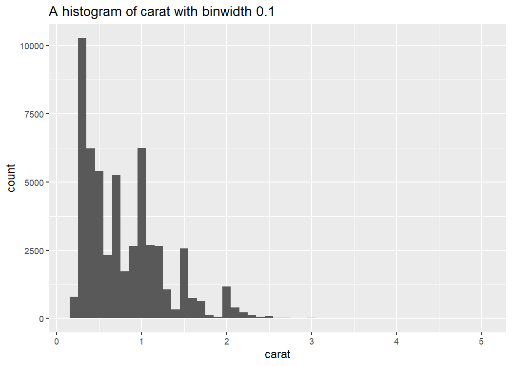
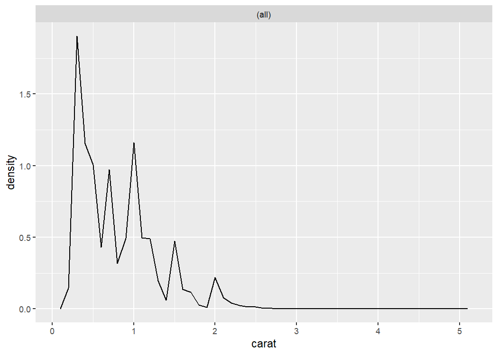
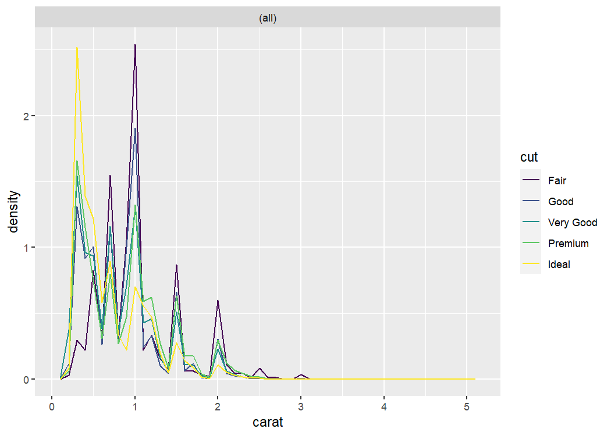
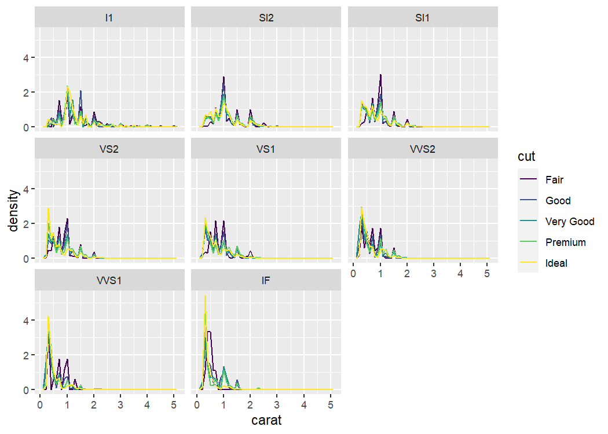

<!-- README.md is generated from README.Rmd. Please edit that file -->

# `himni`

<!-- badges: start -->

[](https://github.com/andrewallenbruce/himni/actions/workflows/R-CMD-check.yaml)
[](https://github.com/andrewallenbruce/himni)
[](https://github.com/andrewallenbruce/himni/commits/master)
[](https://cran.r-project.org/web/licenses/CC0)
[](https://www.repostatus.org/#wip)
<!-- badges: end -->

## Installation

You can install the development version of himni from
[GitHub](https://github.com/) with:

``` r
# install.packages("devtools")
devtools::install_github("andrewallenbruce/himni")

# install.packages("remotes")
remotes::install_github("andrewallenbruce/himni")
```

## Example

``` r
library(himni)
```

``` r
purrr::map_dfr(2013:2020, 
      ~provider::physician_by_service(npi = 1003000126, year = .x)) |> 
  dplyr::select(year, 
                hcpcs_cd, 
                tot_benes, 
                tot_srvcs, 
                avg_sbmtd_chrg, 
                avg_mdcr_alowd_amt, 
                avg_mdcr_pymt_amt) |> 
  dplyr::group_by(year) |> 
  himni::summit(avg_mdcr_pymt_amt) |> 
  dplyr::select(-miss, -skewed, -tailedness) |> 
  gluedown::md_table()
#> | year|      iqr|      mad|      min|      mean|   median|      max| obs|      rng|       sd|  skewness| kurtosis|
#> |----:|--------:|--------:|--------:|---------:|--------:|--------:|---:|--------:|--------:|---------:|--------:|
#> | 2013| 38.09501| 37.05133| 30.06525|  80.61161| 80.64124| 155.9011|   7| 125.8359| 40.95323| 0.7306253| 2.750326|
#> | 2014| 62.63258| 40.12326| 30.83538|  93.49850| 83.05227| 179.0000|   8| 148.1646| 50.64454| 0.5641229| 2.110666|
#> | 2015| 47.74948| 36.49497| 31.01579|  89.82465| 80.92938| 178.0119|  11| 146.9961| 44.70638| 0.8058425| 2.699703|
#> | 2016| 59.24888| 38.23501| 52.83150|  96.24865| 82.30466| 174.5200|  12| 121.6885| 42.87103| 0.6776594| 2.086695|
#> | 2017| 44.47449| 32.27511| 56.36673| 102.20860| 84.05616| 175.7500|  11| 119.3833| 40.33551| 0.6815739| 2.182333|
#> | 2018| 60.50401| 36.52044| 57.67031|  98.61897| 82.51299| 171.8933|  11| 114.2230| 42.16800| 0.7088775| 1.976676|
#> | 2019| 90.84604| 36.64715| 57.87000| 100.81790| 82.58817| 176.4000|   9| 118.5300| 47.51116| 0.6140334| 1.680392|
#> | 2020| 29.52210| 35.10724| 57.95582|  94.47673| 85.08125| 170.8346|   9| 112.8788| 40.37967| 1.0318947| 2.621897|
```

``` r
fancy_ts <- function(df, val, group) {
  labs <- df |> 
    dplyr::group_by({{ group }}) |> 
    dplyr::summarize(breaks = max({{ val }}))
  
  df |> 
    ggplot2::ggplot(
      ggplot2::aes(date, {{ val }},
                   group = {{ group }}, 
                   color = {{ group }})) +
    ggplot2::geom_path() +
    ggplot2::scale_y_continuous(
      breaks = labs$breaks, 
      labels = scales::label_comma(),
      minor_breaks = NULL,
      guide = ggplot2::guide_axis(position = "right")) 
}

df <- tibble::tibble(
  dist1 = sort(rnorm(50, 5, 2)), 
  dist2 = sort(rnorm(50, 8, 3)),
  dist4 = sort(rnorm(50, 15, 1)),
  date = seq.Date(as.Date("2022-01-01"), 
                  as.Date("2022-04-10"), 
                  by = "2 days"))

df <- tidyr::pivot_longer(df, 
                          cols = -date, 
                          names_to = "dist_name", 
                          values_to = "value")

fancy_ts(df, value, dist_name)
```


``` r
cars |> 
  himni::summit(dist) |> 
  dplyr::select("Interquartile Range" = iqr, 
                "Median Absolute Deviation" = mad, 
                Minimum = min, 
                Mean = mean, 
                Median = median, 
                Maximum = max, 
                Observations = n, 
                Missing = n_miss, 
                Range = rng,
                "Standard Deviation" = sd,
                Skewness = skewness,
                Skewed = skewed,
                Kurtosis = kurtosis,
                Tailedness = tailedness) |> 
  dplyr::mutate(dplyr::across(everything(), as.character)) |> 
  tidyr::pivot_longer(cols = dplyr::everything(), 
                      names_to = "Statistic", 
                      values_to = "Value") |> 
  gluedown::md_table()
#> Error in `dplyr::select()`:
#> ! Can't subset columns that don't exist.
#> ✖ Column `n` doesn't exist.
```

``` r
histogram <- function(df, var, binwidth) {
  label <- rlang::englue("A histogram of {{var}} with binwidth {binwidth}")
  
  df |> ggplot2::ggplot(ggplot2::aes({{ var }})) + 
        ggplot2::geom_histogram(binwidth = binwidth) +
        ggplot2::labs(title = label)
}

ggplot2::diamonds |> histogram(carat, 0.1)
```



``` r
density <- function(df, var, color, facets, binwidth = 0.1) {
  df |> 
    ggplot2::ggplot(ggplot2::aes({{ var }}, 
                    ggplot2::after_stat(density), 
                    color = {{ color }})) +
    ggplot2::geom_freqpoly(binwidth = binwidth) +
    ggplot2::facet_wrap(ggplot2::vars({{ facets }}))
}

ggplot2::diamonds |> density(carat)
```



``` r
ggplot2::diamonds |> density(carat, cut)
```



``` r
ggplot2::diamonds |> density(carat, cut, clarity)
```



``` r
purrr::map_dfr(2013:2020, 
      ~provider::physician_by_service(npi = 1003000126, year = .x)) |> 
  dplyr::select(year, 
                hcpcs_cd, 
                tot_benes, 
                tot_srvcs, 
                avg_sbmtd_chrg, 
                avg_mdcr_alowd_amt, 
                avg_mdcr_pymt_amt) |> 
  himni::count_prop(hcpcs_cd, sort = TRUE) |> 
  gluedown::md_table()
```

| hcpcs_cd |   n |      prop |
|:---------|----:|----------:|
| 99223    |   8 | 0.1025641 |
| 99232    |   8 | 0.1025641 |
| 99233    |   8 | 0.1025641 |
| 99239    |   8 | 0.1025641 |
| 99238    |   7 | 0.0897436 |
| 99217    |   6 | 0.0769231 |
| 99221    |   6 | 0.0769231 |
| 99222    |   6 | 0.0769231 |
| 99291    |   6 | 0.0769231 |
| 99220    |   5 | 0.0641026 |
| 99218    |   3 | 0.0384615 |
| 99219    |   3 | 0.0384615 |
| 99231    |   3 | 0.0384615 |
| 99225    |   1 | 0.0128205 |

``` r
options(scipen = 999)
ggplot2::diamonds |> 
  count_prop_mult(c(clarity, color), cut, sort = TRUE) |> 
  head() |> 
  gluedown::md_table()
```

| clarity | color | cut   |    n |      prop |
|:--------|:------|:------|-----:|----------:|
| VS2     | E     | Ideal | 1136 | 0.0210604 |
| VS1     | G     | Ideal |  953 | 0.0176678 |
| VS2     | D     | Ideal |  920 | 0.0170560 |
| VS2     | G     | Ideal |  910 | 0.0168706 |
| VS2     | F     | Ideal |  879 | 0.0162959 |
| VVS2    | G     | Ideal |  774 | 0.0143493 |
