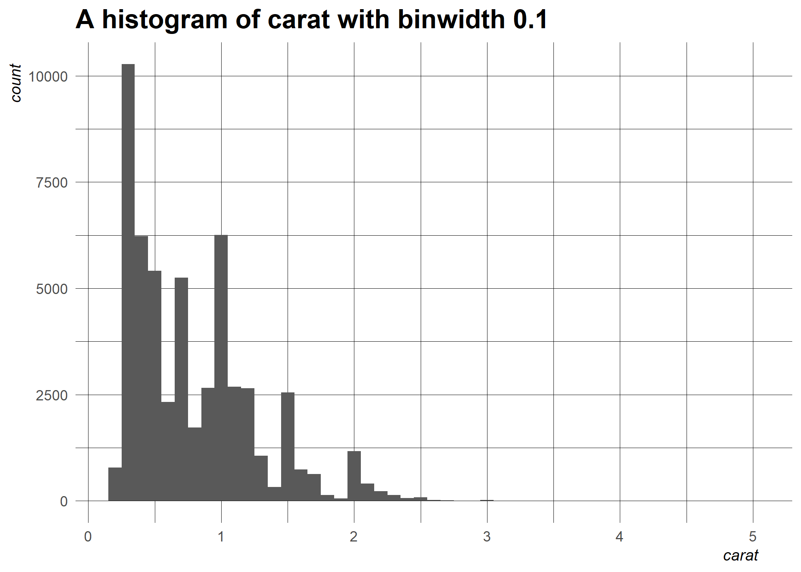
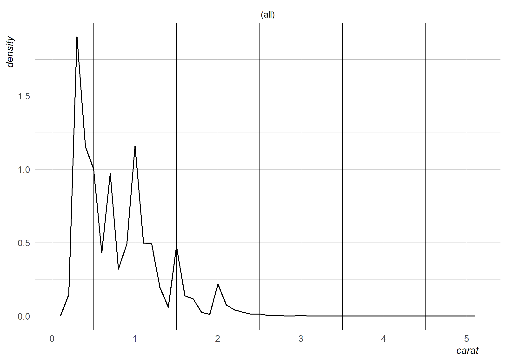
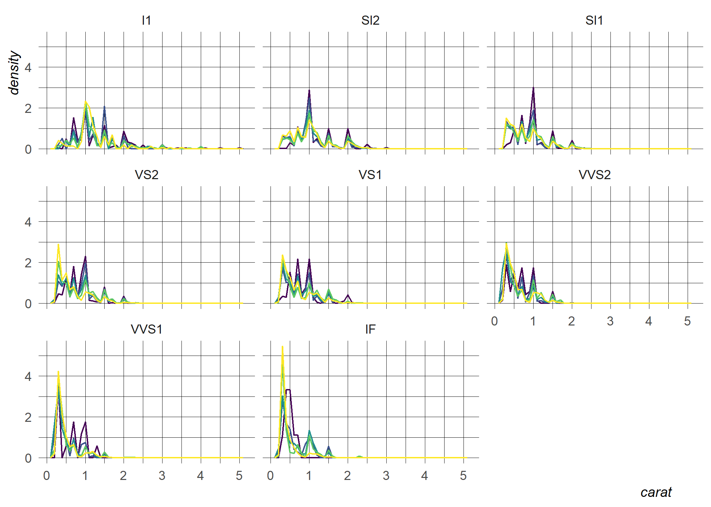

<!-- README.md is generated from README.Rmd. Please edit that file -->

# `himni`

<!-- badges: start -->

[](https://github.com/andrewallenbruce/himni/actions/workflows/R-CMD-check.yaml)
[](https://github.com/andrewallenbruce/himni)
[](https://github.com/andrewallenbruce/himni/commits/master)
[](https://cran.r-project.org/web/licenses/CC0)
[](https://www.repostatus.org/#wip)
<!-- badges: end -->

## Installation

You can install the development version of himni from
[GitHub](https://github.com/) with:

``` r
# install.packages("devtools")
devtools::install_github("andrewallenbruce/himni")

# install.packages("remotes")
remotes::install_github("andrewallenbruce/himni")
```

``` r
library(himni)
```

## Summit

``` r
phys <- purrr::map_dfr(2013:2020, 
      ~provider::physician_by_service(npi = 1003000126, 
                                      year = .x)) |> 
  tidyr::unnest(cols = c(totals_srvcs, 
                         hcpcs, 
                         averages))
```

``` r
phys |> 
  dplyr::select(year, 
                hcpcs_cd, 
                tot_benes, 
                tot_srvcs, 
                avg_sbmtd_chrg, 
                avg_mdcr_alowd_amt, 
                avg_mdcr_pymt_amt) |> 
  dplyr::group_by(year) |> 
  himni::summit(avg_mdcr_pymt_amt) |> 
  dplyr::select(-miss, -obs) |> 
  gluedown::md_table()
```

| year |      min |   median |      mean |      max |      iqr |      rng |       sd |      mad |  skewness | skewed       | kurtosis | tailedness          |
|-----:|---------:|---------:|----------:|---------:|---------:|---------:|---------:|---------:|----------:|:-------------|---------:|:--------------------|
| 2013 | 30.06525 | 80.64124 |  80.61161 | 155.9011 | 38.09501 | 125.8359 | 40.95323 | 37.05133 | 0.7306253 | left-leaning | 2.750326 | broad (platykurtic) |
| 2014 | 30.83538 | 83.05227 |  93.49850 | 179.0000 | 62.63258 | 148.1646 | 50.64454 | 40.12326 | 0.5641229 | left-leaning | 2.110666 | broad (platykurtic) |
| 2015 | 31.01579 | 80.92938 |  89.82465 | 178.0119 | 47.74948 | 146.9961 | 44.70638 | 36.49497 | 0.8058425 | left-leaning | 2.699703 | broad (platykurtic) |
| 2016 | 52.83150 | 82.30466 |  96.24865 | 174.5200 | 59.24888 | 121.6885 | 42.87103 | 38.23501 | 0.6776594 | left-leaning | 2.086695 | broad (platykurtic) |
| 2017 | 56.36673 | 84.05616 | 102.20860 | 175.7500 | 44.47449 | 119.3833 | 40.33551 | 32.27511 | 0.6815739 | left-leaning | 2.182333 | broad (platykurtic) |
| 2018 | 57.67031 | 82.51299 |  98.61897 | 171.8933 | 60.50401 | 114.2230 | 42.16800 | 36.52044 | 0.7088775 | left-leaning | 1.976676 | broad (platykurtic) |
| 2019 | 57.87000 | 82.58817 | 100.81790 | 176.4000 | 90.84604 | 118.5300 | 47.51116 | 36.64715 | 0.6140334 | left-leaning | 1.680392 | broad (platykurtic) |
| 2020 | 57.95582 | 85.08125 |  94.47673 | 170.8346 | 29.52210 | 112.8788 | 40.37967 | 35.10724 | 1.0318947 | left-leaning | 2.621897 | broad (platykurtic) |

``` r
cars |> 
  himni::summit(dist) |> 
  dplyr::select(Minimum = min, 
                Median = median, 
                Mean = mean, 
                Maximum = max, 
                "Interquartile Range" = iqr, 
                Range = rng,
                "Standard Deviation" = sd,
                "Median Absolute Deviation" = mad, 
                Observations = obs, 
                Missing = miss, 
                Skewness = skewness,
                Skewed = skewed,
                Kurtosis = kurtosis,
                Tailedness = tailedness) |> 
  dplyr::mutate(dplyr::across(everything(), as.character)) |> 
  tidyr::pivot_longer(cols = dplyr::everything(), 
                      names_to = "Statistic", 
                      values_to = "Value") |> 
  gluedown::md_table()
```

| Statistic                 | Value                 |
|:--------------------------|:----------------------|
| Minimum                   | 2                     |
| Median                    | 36                    |
| Mean                      | 42.98                 |
| Maximum                   | 120                   |
| Interquartile Range       | 30                    |
| Range                     | 118                   |
| Standard Deviation        | 25.7693774920259      |
| Median Absolute Deviation | 23.7216               |
| Observations              | 50                    |
| Missing                   | 0                     |
| Skewness                  | 0.782483517311497     |
| Skewed                    | left-leaning          |
| Kurtosis                  | 3.24801865717052      |
| Tailedness                | slender (leptokurtic) |

## Proportions

``` r
phys |> 
  dplyr::select(year, 
                hcpcs_cd, 
                tot_benes, 
                tot_srvcs, 
                avg_sbmtd_chrg, 
                avg_mdcr_alowd_amt, 
                avg_mdcr_pymt_amt) |> 
  dplyr::group_by(year) |>
  dplyr::summarise(tot_benes = sum(tot_benes),
                   tot_srvcs = sum(tot_srvcs), 
                   avg_sbmtd_chrg = mean(avg_sbmtd_chrg),
                   avg_mdcr_alowd_amt = mean(avg_mdcr_alowd_amt),
                   avg_mdcr_pymt_amt = mean(avg_mdcr_pymt_amt),
                   .groups = "drop") |> 
  gluedown::md_table()
```

| year | tot_benes | tot_srvcs | avg_sbmtd_chrg | avg_mdcr_alowd_amt | avg_mdcr_pymt_amt |
|-----:|----------:|----------:|---------------:|-------------------:|------------------:|
| 2013 |      1112 |      1607 |       270.9482 |           101.5117 |          80.61161 |
| 2014 |      1748 |      2728 |       361.0683 |           119.6090 |          93.49850 |
| 2015 |      1767 |      2751 |       365.4285 |           114.1929 |          89.82465 |
| 2016 |      1007 |      1450 |       587.6339 |           121.8955 |          96.24865 |
| 2017 |      1088 |      1637 |       620.5018 |           129.9215 |         102.20860 |
| 2018 |       852 |      1192 |       676.9797 |           124.0398 |          98.61897 |
| 2019 |       969 |      1367 |       420.8543 |           126.4571 |         100.81790 |
| 2020 |       488 |       738 |       631.5385 |           118.2449 |          94.47673 |

``` r
options(scipen = 999)
ggplot2::diamonds |> 
  count_prop_mult(c(clarity, color), cut, sort = TRUE) |> 
  head() |> 
  gluedown::md_table()
```

| clarity | color | cut   |    n |      prop |
|:--------|:------|:------|-----:|----------:|
| VS2     | E     | Ideal | 1136 | 0.0210604 |
| VS1     | G     | Ideal |  953 | 0.0176678 |
| VS2     | D     | Ideal |  920 | 0.0170560 |
| VS2     | G     | Ideal |  910 | 0.0168706 |
| VS2     | F     | Ideal |  879 | 0.0162959 |
| VVS2    | G     | Ideal |  774 | 0.0143493 |

## ggplots

``` r
ggplot2::diamonds |> himni::histogram(carat, 0.1) + himni::gg_theme()
```



``` r
ggplot2::diamonds |> himni::density(carat) + himni::gg_theme()
```



``` r
ggplot2::diamonds |> himni::density(carat, cut) + himni::gg_theme()
```


``` r
ggplot2::diamonds |> himni::density(carat, cut, clarity) + himni::gg_theme()
```


